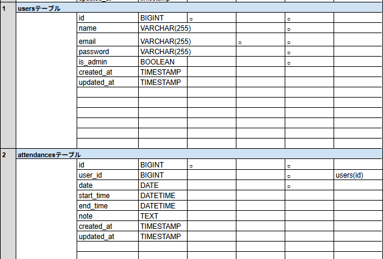
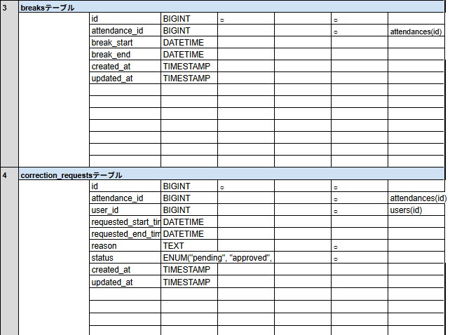
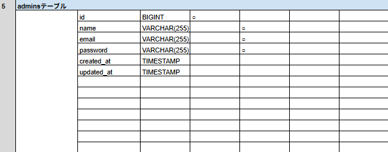
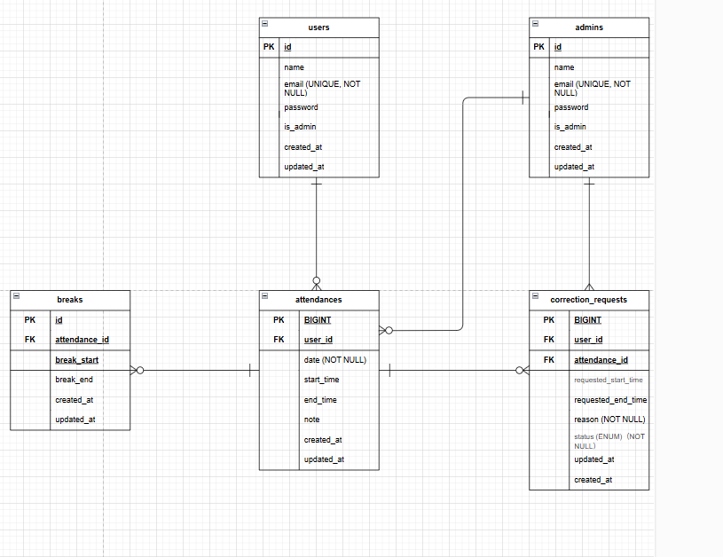

# coachtech 勤怠管理アプリ
---
## 環境構築
---
#### Dockerビルド
  1. git clone git@github.com:yumi0217/smartwork-test.git
  2. cd smartwork-test
  3. DockerDesktopアプリを立ち上げる
  4. docker-compose up -d --build
#### Laravel環境構築
  1. docker-compose exec php bash
  2. composer install
  3. 「.env.example」ファイルを 「.env」ファイルに命名を変更。または、新しく.envファイルを作成
  4. .envに以下の環境変数を追加
```
DB_CONNECTION=mysql
DB_HOST=mysql
DB_PORT=3306
DB_DATABASE=laravel_db
DB_USERNAME=laravel_user
DB_PASSWORD=laravel_pass
``` 
  5. アプリケーションキーの作成
```
php artisan key:generate
```
  6. マイグレーションの実行
```
php artisan migrate
```
  7. シーディングの実行
```
php artisan db:seed
```
### ダミーデータの生成に使われるファイル
- `AttendanceSeeder.php`：出退勤の勤怠データを作成
- `BreakSeeder.php`：各勤怠に対応する休憩時間を作成
- `CorrectionRequestSeeder.php`：勤怠修正申請データを作成
- `UserSeeder.php`：管理者・一般ユーザーの初期データを作成

### DatabaseSeeder.php 内容
```
public function run()
    {
        $this->call([
            UserSeeder::class,
            AttendanceSeeder::class,
            BreakSeeder::class,
            CorrectionRequestSeeder::class,
        ]);
    }
```

## 認証機能
---
Laravel Fortify を使用して以下の機能を実装しています：

- 会員登録
- ログイン／ログアウト
- パスワード変更  

---

  8. Fortify のインストール
```
composer require laravel/fortify
```
  9. Fortify の設定ファイルを公開
```
php artisan vendor:publish --provider="Laravel\Fortify\FortifyServiceProvider"
```
  10. config/fortify.php の設定確認・編集（機能の有効化）
```
'features' => [
    Features::registration(),
    Features::resetPasswords(),
    Features::updateProfileInformation(),
    Features::updatePasswords(),
],
```
  11. FortifyServiceProviderの設定
```
Fortify::loginView(function () {
    return request()->is('admin/*')
    ? view('auth.admin-login')
    : view('auth.login');
});

Fortify::registerView(function () {
    return view('auth.register');
});

```

## テストログイン情報（ダミーユーザー）
---

| 役割     | メールアドレス         | パスワード     | 備考                         |
|----------|------------------------|----------------|---------------------------|
| 管理者   | admin@example.com      | password123     | 勤怠管理、申請承認などが可能 |
※一般ユーザーは、会員登録画面より各自でアカウントを作成してください。

## 使用技術(実行環境)
---
  - PHP8.1.33
  - Laravel8.83.29
  - MySQL8.0.26 
  - mailHog（開発中のメール確認ツール,会員登録する際は開いておく必要あり！）
  - JavaScript（画像プレビュー機能、カスタムUIに使用）
  - Bladeテンプレートエンジン（ビュー構築）
  - CSS（デザインカスタマイズ）
  - Eloquent ORM（モデルとDBの連携）

## メール確認
---
- mailHog: http://localhost:8025

## テーブル設計
---




## 備考
※「申請一覧画面」に表示される一部の承認待ちユーザーは、シーディングにより登録されたダミーデータです

## ER図
---

## URL
---
  - 開発環境：http://localhost/
  - phpMyAdmin:：http://localhost:8080/